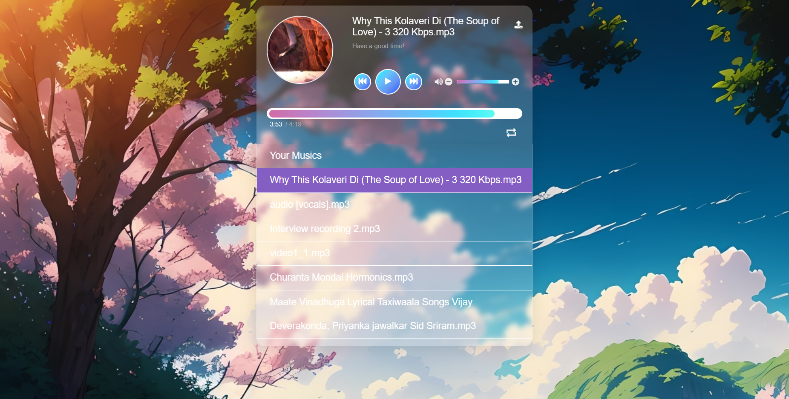

# Music Player Web Application

This is a simple web application for a music player. It includes features like adding music, controlling playback, and displaying a list of available tracks.

## Getting Started

1. **Clone the Repository:**
   ```
   git clone https://github.com/Churanta/Coding-Raja-Technologies-Internship--Task-2.git
   ```

2. **Open the HTML File:**
   ```
   Open the index.html file in a web browser.
   ```

## Features

- **Add Music:** Use the "Add Music" button to upload audio files (mp3, ogg) and add them to the playlist.
- **Playback Control:** Control playback with play, pause, next, and previous track buttons.
- **Volume Control:** Adjust the volume using the volume control buttons.
- **Track Progress:** View the progress of the currently playing track with a progress bar.
- **Playlist:** See the list of available tracks in the playlist.

## Usage

1. Open the application in a web browser.
2. Upload audio files using the "Add Music" button.
3. Control playback using the play, pause, next, and previous buttons.
4. Adjust the volume using the volume control buttons.
5. View track progress with the progress bar.
6. Explore the playlist to see the available tracks.

**Video Demo:**
[](video.mp4)


https://github.com/Churanta/Coding-Raja-Technologies-Internship--Task-2/assets/83538805/5da87426-20a7-4703-8529-4177b97acde8


## Contributing

Contributions are welcome! If you have any suggestions, bug reports, or feature requests, please open an issue or submit a pull request.


## License

This project is licensed under the [MIT License](LICENSE.md).

## Acknowledgments

- Icons provided by [Font Awesome](https://fontawesome.com/).
- CSS styles inspired by [https://css.glass](https://css.glass).

Feel free to customize this README to better suit your project and provide more specific information.# Coding-Raja-Technologies-Internship--Task-2
